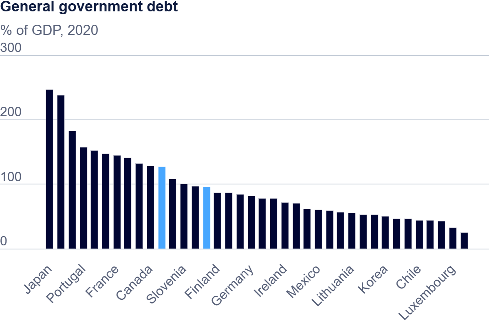

| [home page](https://adityakolpe.github.io/Data-Canvas/) | [visualizing debt](visualizing-government-debt) | [critique by design](critique-by-design) | [final project I](final-project-part-one) | [final project II](final-project-part-two) | [final project III](final-project-part-three) |

# Vizualizing Debt

## Part one: Working with web-based visualization tools and data

I selected "General government debt" for the debt-to-GDP ratio, reviewed the chart, and highlighted a few countries. I adjusted the slider to view data for one year at a time and experimented with recent years with good data coverage. Then, I downloaded the chart as a .png and .csv, saved the .png to my repository, added it to my portfolio page, and confirmed it displayed correctly on my webpage.

> Source <a href="https://www.oecd.org/en/data/indicators/general-government-debt.html?oecdcontrol-3122613a85-var3=2020">oecd.org</a>

## Working with Tableau

### Discrete Line Chart

<noscript></noscript>
  <object class='tableauViz'  style='display:none;'>
  <param name='host_url' value='https%3A%2F%2Fpublic.tableau.com%2F' /> 
    <param name='embed_code_version' value='3' /> 
    <param name='site_root' value='' />
    <param name='name' value='Debt-To-GDPRatiobyCountry&#47;DiscreteLineChart' />
    <param name='tabs' value='no' />
    <param name='toolbar' value='yes' />
    <param name='static_image' value='https:&#47;&#47;public.tableau.com&#47;static&#47;images&#47;De&#47;Debt-To-GDPRatiobyCountry&#47;DiscreteLineChart&#47;1.png' /> 
    <param name='animate_transition' value='yes' />
    <param name='display_static_image' value='yes' />
    <param name='display_spinner' value='yes' />
    <param name='display_overlay' value='yes' />
    <param name='display_count' value='yes' />
    <param name='language' value='en-US' />
    <param name='filter' value='publish=yes' />
  </object>
                
  

### Tree Map

<noscript></noscript><object class='tableauViz'  style='display:none;'><param name='host_url' value='https%3A%2F%2Fpublic.tableau.com%2F' /> <param name='embed_code_version' value='3' /> <param name='site_root' value='' /><param name='name' value='Debt-To-GDPRatiobyCountry-Heatmap&#47;DiscreteLineChart' /><param name='tabs' value='no' /><param name='toolbar' value='yes' /><param name='static_image' value='https:&#47;&#47;public.tableau.com&#47;static&#47;images&#47;De&#47;Debt-To-GDPRatiobyCountry-Heatmap&#47;DiscreteLineChart&#47;1.png' /> <param name='animate_transition' value='yes' /><param name='display_static_image' value='yes' /><param name='display_spinner' value='yes' /><param name='display_overlay' value='yes' /><param name='display_count' value='yes' /><param name='language' value='en-US' /><param name='filter' value='publish=yes' /></object>

## Part three: Creating a Unique Vizualization which tells a story

### Debt-to-GDP Percentage Contribution per Country

<noscript></noscript><object class='tableauViz'  style='display:none;'><param name='host_url' value='https%3A%2F%2Fpublic.tableau.com%2F' /> <param name='embed_code_version' value='3' /> <param name='site_root' value='' /><param name='name' value='Debt-to-GDPPercentageContributionperCountry&#47;Sheet2' /><param name='tabs' value='no' /><param name='toolbar' value='yes' /><param name='static_image' value='https:&#47;&#47;public.tableau.com&#47;static&#47;images&#47;De&#47;Debt-to-GDPPercentageContributionperCountry&#47;Sheet2&#47;1.png' /> <param name='animate_transition' value='yes' /><param name='display_static_image' value='yes' /><param name='display_spinner' value='yes' /><param name='display_overlay' value='yes' /><param name='display_count' value='yes' /><param name='language' value='en-GB' /><param name='filter' value='publish=yes' /></object>
   

In this assignment, I explored various data visualization methods using both online tools and Tableau. Each method provided distinct ways of representing data, and each had unique advantages and limitations depending on the data’s complexity and the message I aimed to convey. Online tools generally offer quick and intuitive ways to create basic visualizations, like bar charts, line graphs, and scatter plots. These tools often automate data aggregation and formatting, making them accessible for beginners or for quickly visualizing straightforward datasets. Tableau, on the other hand, is more powerful and flexible, especially useful when working with large datasets or when creating multi-dimensional visualizations that require more customization and control over details. Tableau allows for interactive dashboards and advanced calculations, making it ideal for exploring complex relationships within the data.

In the third visualization, I calculated each country's percentage contribution to the global debt-to-GDP ratio and displayed it using stacked bar charts. This approach shows each country’s share of global debt over time, with color highlighting for countries contributing over 5%. I chose standard stacked bars over 100% stacked bars, as the total debt-to-GDP fluctuates yearly, making the standard format more effective for observing both absolute and relative changes.
